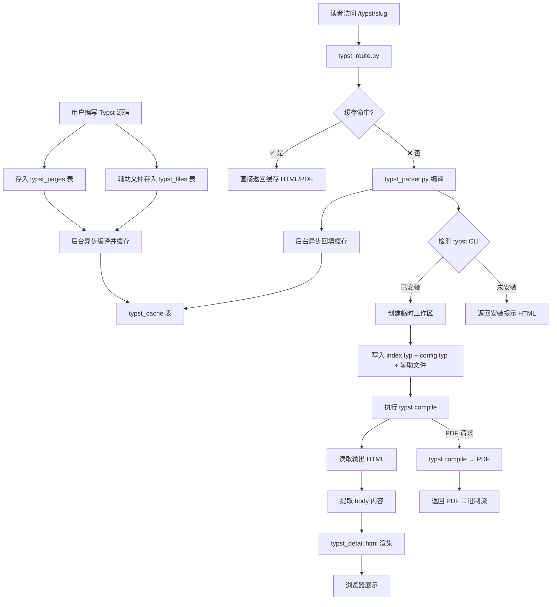
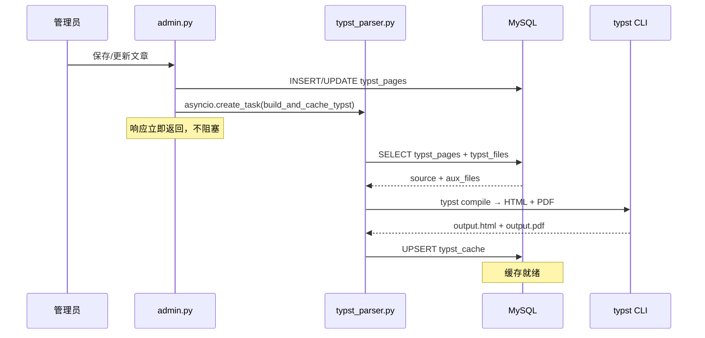
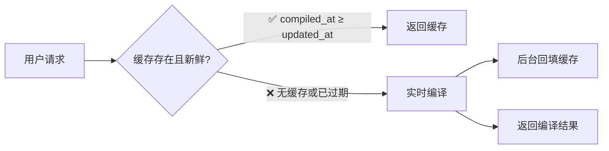
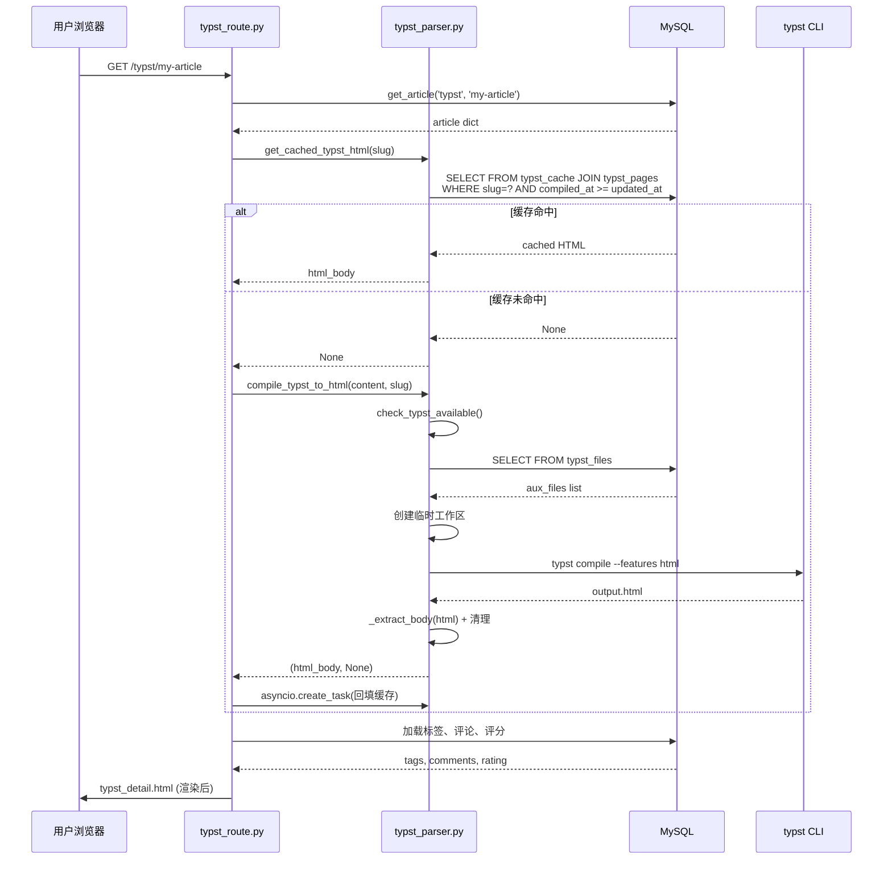

# Typst 模块实现文档

本文档详细说明 PyKYCH 中 Typst 标记语言支持的完整技术实现，包括模块架构、数据流、数据库设计、编译流程和模板系统。

## 目录

- [架构概览](#架构概览)
- [模块结构](#模块结构)
- [数据库设计](#数据库设计)
- [核心解析器：typst_parser.py](#核心解析器typst_parserpy)
  - [Typst CLI 检测](#typst-cli-检测)
  - [引用路径解析](#引用路径解析)
  - [编译工作区构建](#编译工作区构建)
  - [HTML 编译流程](#html-编译流程)
  - [PDF 编译流程](#pdf-编译流程)
  - [编译缓存系统](#编译缓存系统)
  - [辅助文件管理](#辅助文件管理)
- [路由层：typst_route.py](#路由层typst_routepy)
- [统一文章管理](#统一文章管理)
- [共享模板：config.typ](#共享模板configtyp)
- [前端模板](#前端模板)
- [ENUM 迁移机制](#enum-迁移机制)
- [数据流全览](#数据流全览)
- [API 参考](#api-参考)

---

## 架构概览

Typst 模块是 PyKYCH 的第五种文章类型支持（继 Markdown、Wikidot、HTML、BBCode 之后）。它通过调用系统安装的 `typst` CLI 将 Typst 标记语言编译为 HTML 和 PDF，实现"一次编写，双格式输出"。编译结果会自动缓存至数据库，后续访问直接命中缓存，大幅提升响应速度。



---

## 模块结构

```
src/pykych/
├── content/
│   ├── articles.py              # 统一文章 CRUD（含 typst 类型）
│   └── parsers/
│       ├── __init__.py           # 导出 typst 解析 + 缓存函数
│       └── typst_parser.py       # ★ 核心：Typst → HTML / PDF 编译器 + 缓存管理
├── core/
│   └── schema.py                 # 数据库表定义（含 typst_pages / typst_files / typst_cache）
├── routes/
│   ├── typst_route.py            # ★ 路由：列表 / 详情 / PDF 下载（缓存优先）
│   └── admin.py                  # 管理后台：创建/更新时触发缓存预编译
└── templates/
    ├── typst_list.html           # Typst 文章列表页模板
    └── typst_detail.html         # Typst 文章详情页模板

data/
└── typst/
    └── config.typ                # ★ 共享 Typst 模板（文章排版、提示块等）
```

---

## 数据库设计

Typst 使用三张专用表，与其他文章类型共享 `article_tags`、`comments`、`ratings` 等关联表。

### typst_pages — 文章主表

```sql
CREATE TABLE IF NOT EXISTS typst_pages (
    id          INT AUTO_INCREMENT PRIMARY KEY,
    slug        VARCHAR(255) UNIQUE NOT NULL,   -- URL 友好标识符
    title       VARCHAR(255) NOT NULL,           -- 文章标题
    content     LONGTEXT NOT NULL,               -- Typst 源码
    author_id   INT DEFAULT NULL,
    created_at  DATETIME NOT NULL DEFAULT CURRENT_TIMESTAMP,
    updated_at  DATETIME NOT NULL DEFAULT CURRENT_TIMESTAMP ON UPDATE CURRENT_TIMESTAMP,
    INDEX idx_slug (slug),
    INDEX idx_created (created_at)
) ENGINE=InnoDB DEFAULT CHARSET=utf8mb4 COLLATE=utf8mb4_unicode_ci;
```

### typst_files — 辅助文件表

存储文章引用的外部模块、配置文件、图片元数据等。通过 `page_id` 外键关联主表。

```sql
CREATE TABLE IF NOT EXISTS typst_files (
    id          INT AUTO_INCREMENT PRIMARY KEY,
    page_id     INT NOT NULL,                    -- 关联 typst_pages.id
    filename    VARCHAR(255) NOT NULL,           -- 相对路径（如 'lib/utils.typ'）
    content     LONGTEXT NOT NULL,               -- 文件内容
    created_at  DATETIME NOT NULL DEFAULT CURRENT_TIMESTAMP,
    UNIQUE KEY uq_page_file (page_id, filename), -- 同一文章内文件名唯一
    INDEX idx_page (page_id),
    FOREIGN KEY (page_id) REFERENCES typst_pages(id) ON DELETE CASCADE
) ENGINE=InnoDB DEFAULT CHARSET=utf8mb4 COLLATE=utf8mb4_unicode_ci;
```

### typst_cache — 编译缓存表

存储文章预编译的 HTML 和 PDF，加速用户访问。通过 `page_id` 外键关联主表，删除文章时自动级联清理。

```sql
CREATE TABLE IF NOT EXISTS typst_cache (
    id           INT AUTO_INCREMENT PRIMARY KEY,
    page_id      INT NOT NULL UNIQUE,
    html_content LONGTEXT NOT NULL,              -- 预编译的 HTML（已提取 body）
    pdf_content  LONGBLOB NOT NULL,              -- 预编译的 PDF 二进制
    compiled_at  DATETIME NOT NULL DEFAULT CURRENT_TIMESTAMP,
    FOREIGN KEY (page_id) REFERENCES typst_pages(id) ON DELETE CASCADE,
    INDEX idx_page (page_id)
) ENGINE=InnoDB DEFAULT CHARSET=utf8mb4 COLLATE=utf8mb4_unicode_ci;
```

**缓存新鲜度判断：** 查询缓存时，通过 `JOIN typst_pages` 并检查 `tc.compiled_at >= tp.updated_at` 确保缓存未被过期。若文章被修改，`updated_at` 会更新，旧缓存自动失效。

### 与其他表的关联

Typst 通过 `article_type = 'typst'` 参与统一的内容生态：

| 表 | 关联方式 |
|---|---|
| `article_tags` | `article_type = 'typst'` + `article_slug` |
| `comments` | `article_type = 'typst'` + `article_slug` |
| `line_comments` | `article_type = 'typst'` + `article_slug` |
| `ratings` | `article_type = 'typst'` + `article_slug` |
| `featured_articles` | `article_type = 'typst'` + `article_slug` |

---

## 核心解析器：typst_parser.py

`typst_parser.py` 是整个 Typst 模块的心脏，负责将 Typst 源码编译为 HTML 或 PDF。其设计遵循"临时工作区"模式——每次编译都在隔离的临时目录中进行，编译完成后立即清理。

### Typst CLI 检测

模块在首次调用时自动检测系统中是否安装了 `typst` 可执行文件，按以下优先级查找：

| 优先级 | 来源 | 说明 |
|--------|------|------|
| 1 | 环境变量 `TYPST_PATH` | 用户显式指定路径 |
| 2 | `shutil.which("typst")` | 系统 PATH 中查找 |
| 3 | 常见安装目录 | `/opt/homebrew/bin/typst`（Apple Silicon）、`/usr/local/bin/typst`（Intel Mac）、`/usr/bin/typst`（Linux）、`~/.cargo/bin/typst`（Cargo） |

检测结果会被缓存，通过 `clear_typst_cache()` 可清除缓存（例如用户安装 Typst 后）。

**关键函数：**

| 函数 | 用途 |
|------|------|
| `get_typst_path()` | 获取 typst 可执行文件路径（带缓存） |
| `check_typst_available()` | 检测 typst 是否可用（返回 bool） |
| `clear_typst_cache()` | 清除检测缓存 |

### 引用路径解析

Typst 支持 `#import` 和 `#include` 指令引用其他文件。模块提供了两个正则提取函数：

```python
# 提取本地 .typ 文件引用
_IMPORT_RE = re.compile(r'#(?:import|include)\s*"([^"]+\.typ)"')

# 提取图片引用
_IMAGE_RE = re.compile(r'image\s*\(\s*"([^"]+\.(?:png|jpg|jpeg|gif|svg|webp))"')
```

| 函数 | 用途 |
|------|------|
| `extract_local_imports(source)` | 提取所有本地 `.typ` 文件引用（跳过 `@preview` 包导入） |
| `extract_image_refs(source)` | 提取所有图片文件引用 |

### 编译工作区构建

每次编译前，`_write_workspace()` 会在临时目录中构建完整的 Typst 项目结构：

```
/tmp/pykych_typst_xxxxx/
├── index.typ          ← 文章主文件（用户源码）
├── config.typ          ← 共享配置模板（从 data/typst/config.typ 复制）
├── lib/               ← 辅助文件（按原相对路径展开）
│   └── utils.typ
├── .cache/            ← XDG 缓存（隔离，避免权限问题）
└── .runtime/          ← XDG 运行时目录
```

**安全措施：**
- 辅助文件路径经过 `os.path.normpath()` 归一化
- 阻止 `..` 路径遍历攻击
- 阻止绝对路径注入
- 子进程环境变量 `HOME`、`XDG_CACHE_HOME`、`XDG_RUNTIME_DIR` 均指向临时目录

### HTML 编译流程

```python
async def compile_typst_to_html(
    source: str,
    slug: str = "",
    aux_files: list[dict] | None = None,
) -> tuple[str, Optional[str]]:
```

**执行步骤：**

1. **检测 CLI** — 若 typst 未安装，返回友好的安装提示 HTML
2. **获取辅助文件** — 若未提供 `aux_files`，从数据库按 slug 查询
3. **读取共享配置** — 若 `data/typst/config.typ` 存在，加载之
4. **创建临时工作区** — `tempfile.mkdtemp(prefix="pykych_typst_")`
5. **写入文件** — 调用 `_write_workspace()` 构建项目结构
6. **执行编译** — `typst compile --features html --format html index.typ output.html`
7. **后处理** — `_extract_body()` 提取 `<body>` 内容，剥离完整 HTML 文档壳
8. **清理** — `finally` 块中 `shutil.rmtree()` 删除临时目录

**超时保护：** 编译超时设为 60 秒，超时后返回错误 HTML。

**错误处理：**

| 异常类型 | 返回行为 |
|----------|----------|
| Typst 未安装 | 返回安装指南 HTML + 错误消息 |
| 编译错误 (returncode ≠ 0) | 返回 stderr 格式化的错误 HTML |
| `subprocess.TimeoutExpired` | 返回超时提示 HTML |
| `FileNotFoundError` | 返回未安装提示 HTML |
| 其他异常 | 返回异常信息 HTML |

### PDF 编译流程

```python
async def compile_typst_to_pdf(
    source: str,
    slug: str = "",
    aux_files: list[dict] | None = None,
) -> tuple[Optional[bytes], Optional[str]]:
```

与 HTML 编译流程基本一致，区别在于：
- 不使用 `--features html --format html` 参数
- 输出文件扩展名为 `.pdf`
- 返回 `bytes` 而非字符串
- 通过 `/typst/{slug}/pdf` 端点以 `application/pdf` MIME 类型返回

### 辅助文件管理

提供三个数据库操作函数供路由层使用：

| 函数 | 用途 | SQL 行为 |
|------|------|----------|
| `get_aux_files(slug)` | 获取文章所有辅助文件 | `SELECT ... JOIN` |
| `save_aux_file(slug, filename, content)` | 保存/更新辅助文件 | `INSERT ... ON DUPLICATE KEY UPDATE` |
| `delete_aux_file(slug, filename)` | 删除辅助文件 | `DELETE ... JOIN` |

### 编译缓存系统

为避免每次访问都重新编译（Typst 编译通常耗时 1~5 秒），系统引入了数据库级编译缓存。文章保存/更新后**后台异步**预编译 HTML 和 PDF 存入 `typst_cache` 表；用户访问时**优先读取缓存**，仅缓存失效时才实时编译。



**缓存读取流程：**



**缓存 API：**

| 函数 | 用途 |
|------|------|
| `build_and_cache_typst(slug)` | 读取文章源码 + 辅助文件 → 编译 HTML + PDF → UPSERT 到 `typst_cache`。任一种编译失败则放弃缓存，返回 `False` |
| `get_cached_typst_html(slug)` | 从缓存表读取 HTML，若 `compiled_at >= updated_at` 则返回，否则返回 `None` |
| `get_cached_typst_pdf(slug)` | 同上，返回 PDF 字节 |
| `invalidate_typst_cache(slug)` | 手动删除缓存（一般不直接调用，删除文章时 FK CASCADE 自动清理） |

**缓存触发时机：**

| 时机 | 调用方式 | 说明 |
|------|----------|------|
| 管理员创建文章 | `asyncio.create_task(build_and_cache_typst)` | 后台异步，不阻塞响应 |
| 管理员更新文章 | 同上 | 同上 |
| 用户访问且缓存未命中 | `asyncio.create_task(_fill_cache_after_miss)` | 实时编译后异步回填 |
| 文章被删除 | FK CASCADE 自动删除 | 无需额外代码 |

---

## 路由层：typst_route.py

使用 Starlette 的 `Route` 定义三个端点：

### GET `/typst`

文章列表页。分页查询 `typst_pages` 表，每页 10 篇，渲染 `typst_list.html`。页面顶部若检测到 Typst 未安装会显示警告横幅。

### GET `/typst/{slug}`

文章详情页。核心流程（**缓存优先**）：

```
1. db.get_article('typst', slug)        → 获取文章记录
2. get_cached_typst_html(slug)          → 尝试读取缓存
3. 若缓存命中 → 直接使用
   若缓存未命中 → compile_typst_to_html(content) → 异步回填缓存
4. 加载标签、评论、行评论、评分          → 关联数据
5. get_current_user(request)             → 当前用户
6. render('typst_detail.html', ...)      → 渲染页面
```

### GET `/typst/{slug}/pdf`

PDF 下载端点（**缓存优先**）。先调用 `get_cached_typst_pdf(slug)`，命中则直接返回；未命中则调用 `compile_typst_to_pdf()` 实时编译，并在后台异步回填缓存。以 `Content-Disposition: attachment` 返回。

---

## 统一文章管理

Typst 作为第五种文章类型集成到 `articles.py` 的统一 CRUD 系统中。

```python
ARTICLE_TYPES = {
    # ...
    "typst": {
        "label": "Typst",
        "table": "typst_pages",
        "list_cols": "id, slug, title, author_id, created_at, updated_at",
        "default_tag": "typst",
        "url_prefix": "/typst",
        "form_title_new": "新建 Typst 文章",
        "form_title_edit": "编辑 Typst 文章",
    },
}
```

所有文章类型共享同一套 `list_articles()`、`get_article()`、`create_article()`、`update_article()`、`delete_article()` 接口，通过 `article_type` 参数区分目标表。

**Typst 特有后处理：** `admin.py` 的 `_article_create()` 和 `_article_update()` 在保存 Typst 文章成功后，通过 `asyncio.create_task(build_and_cache_typst(slug))` 触发后台异步预编译缓存。此操作不阻塞 HTTP 响应，管理员无需等待编译完成。

---

## 共享模板：config.typ

`data/typst/config.typ` 是所有 Typst 文章的共享样式与模板文件。编译时自动复制到工作区，文章通过 `#import "config.typ"` 引用。

### 字体系统

三级回退链，Typst 自动使用第一个在系统中找到的字体：

| 类别 | 优先级列表 |
|------|-----------|
| 衬线 (Serif) | Noto Serif CJK SC → Source Han Serif SC → Songti SC → SimSun → STSong |
| 无衬线 (Sans) | Sarasa Gothic SC → Noto Sans CJK SC → Source Han Sans SC → PingFang SC → Heiti SC → STHeiti |
| 等宽 (Mono) | Sarasa Mono SC → Noto Sans Mono CJK SC → WenQuanYi Zen Hei Mono → STFangsong |

### 颜色主题

```typst
#let accent-color  = rgb("#3b82f6")   // 蓝色强调
#let bg-code       = rgb("#f1f5f9")   // 代码背景
#let border-color  = rgb("#e2e8f0")   // 边框颜色
#let text-primary  = rgb("#1e293b")   // 正文颜色
// ... 以及 note / tip / warning / danger 四组提示块配色
```

### 全局排版设置

`base-typography` 块配置中文排版最佳实践：
- 语言标记：`lang: "zh"`, `region: "CN"`
- 行间距：`leading: 0.7em`
- 段间距：`spacing: 0.85em`
- 两端对齐：`justify: true`
- 无首行缩进（文章风格，用段间距区分段落）

### 元素样式覆盖

通过 `show` 规则覆盖所有标准元素的渲染：

| 元素 | 样式定制 |
|------|----------|
| 一/二/三级标题 | 无衬线字体 + 不同字号和粗细 + 上下间距 |
| 代码块 | 浅灰背景 + 圆角边框 + 等宽字体 |
| 行内代码 | 浅灰背景 + 微小内边距 + 等宽字体 |
| 引用块 | 左侧蓝色竖线 + 次要文字颜色 |
| 表格 | 小号无衬线字体 |
| 超链接 | 蓝色 + 下划线 |
| 列表 | 紧凑段间距 |

### 提示块（Admonitions）

四种语义化提示块，各有独立配色：

```typst
#note(正文)     // 📝 蓝色 — 补充说明
#tip(正文)      // 💡 绿色 — 技巧建议
#warning(正文)  // ⚠️ 橙色 — 注意事项
#danger(正文)   // 🚫 红色 — 严重警告
```

### article 模板

`article` 函数是文章的主模板入口，支持参数：

| 参数 | 类型 | 默认值 | 说明 |
|------|------|--------|------|
| `title` | `none` / string | `none` | 文章标题（不提供则使用第一个一级标题） |
| `subtitle` | `none` / string | `none` | 副标题 |
| `author` | `none` / string | `none` | 作者名 |
| `date` | `none` / string | `none` | 发布日期 |
| `tags` | array | `()` | 标签列表 |
| `show-toc` | bool | `false` | 是否显示目录 |
| `toc-title` | content | `[目录]` | 目录标题 |
| `paper-size` | string | `"a4"` | PDF 纸张尺寸 |
| `font-size` | length | `12pt` | 正文字号 |

**HTML / PDF 双目标适配：** 模板内通过 `context { if target == "html" { ... } else { ... } }` 实现差异化排版——HTML 无页边距限制，PDF 使用 A4 纸张 + 2.2cm 边距 + 页码。

---

## 前端模板

### typst_list.html

- 继承 `base.html`
- 页头显示文章总数
- Typst 未安装时显示黄色警告横幅（含安装命令）
- 文章卡片列表（标题、日期、标签）
- 分页导航

### typst_detail.html

- 继承 `base.html`
- 内联 `<style>` 定义 `.typst-content` 排版增强：
  - 标题层级样式（h1/h2/h3）
  - 引用块左侧彩色竖线
  - 代码块浅灰背景 + 圆角
  - 表格边框
  - 图片自适应
- 底部集成评论区、行评论、评分组件
- 显示 PDF 下载按钮（调用 `/typst/{slug}/pdf`）

---

## ENUM 迁移机制

由于 Typst 是后期新增的文章类型，已有数据库的 ENUM 列不包含 `'typst'` 值。系统通过两个迁移函数自动处理：

### `_migrate_enums_for_typst()`

在 `init_tables()` 中调用，对以下表的 `article_type` 列执行 ALTER：

| 表 | 新 ENUM 定义 |
|---|---|
| `comments` | `ENUM('md','wikidot','html','bbcode','typst')` |
| `line_comments` | 同上 |
| `ratings` | 同上 |
| `featured_articles` | 同上 |

使用 `try/except` 包裹，若列已是目标定义则静默跳过。

### `_migrate_add_default_tags()`

为已有文章补充默认标签——扫描各文章表，对尚无标签记录的文章调用 `auto_tag_article()` 自动打标。

---

## 数据流全览



---

## API 参考

### 解析器模块 (`pykych.content.parsers.typst_parser`)

```python
# 编译函数
async def compile_typst_to_html(
    source: str,
    slug: str = "",
    aux_files: list[dict] | None = None,
) -> tuple[str, Optional[str]]
"""
将 Typst 源码编译为 HTML。
返回: (html_content, error_message)
  - 成功时 error_message 为 None
  - 失败时 html_content 为包含错误信息的 HTML
"""

async def compile_typst_to_pdf(
    source: str,
    slug: str = "",
    aux_files: list[dict] | None = None,
) -> tuple[Optional[bytes], Optional[str]]
"""
将 Typst 源码编译为 PDF。
返回: (pdf_bytes, error_message)
  - 成功时 error_message 为 None
  - 失败时 pdf_bytes 为 None
"""

# CLI 检测
def check_typst_available() -> bool
def get_typst_path() -> str
def clear_typst_cache() -> None

# 路径提取
def extract_local_imports(source: str) -> list[str]
def extract_image_refs(source: str) -> list[str]

# 辅助文件管理
async def get_aux_files(slug: str) -> list[dict]
async def save_aux_file(slug: str, filename: str, content: str) -> bool
async def delete_aux_file(slug: str, filename: str) -> bool

# 编译缓存
async def build_and_cache_typst(slug: str) -> bool
async def get_cached_typst_html(slug: str) -> str | None
async def get_cached_typst_pdf(slug: str) -> bytes | None
async def invalidate_typst_cache(slug: str) -> bool
```

### 路由端点

| 方法 | 路径 | 功能 |
|------|------|------|
| GET | `/typst` | Typst 文章列表（分页） |
| GET | `/typst/{slug}` | 文章详情（编译 Typst → HTML） |
| GET | `/typst/{slug}/pdf` | 下载 PDF 版本 |

### 数据库表

| 表 | 用途 |
|---|---|
| `typst_pages` | 存储 Typst 文章源码和元数据 |
| `typst_files` | 存储文章关联的辅助文件（模块、配置等） |
| `typst_cache` | 存储预编译的 HTML 和 PDF 缓存 |

---

> **相关文档：** 用户面向的 Typst 使用指南见 [Typst 写作指南](./Typst写作指南.md)。
